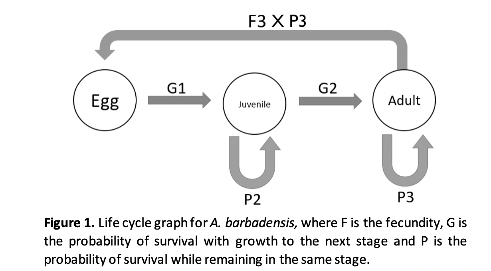
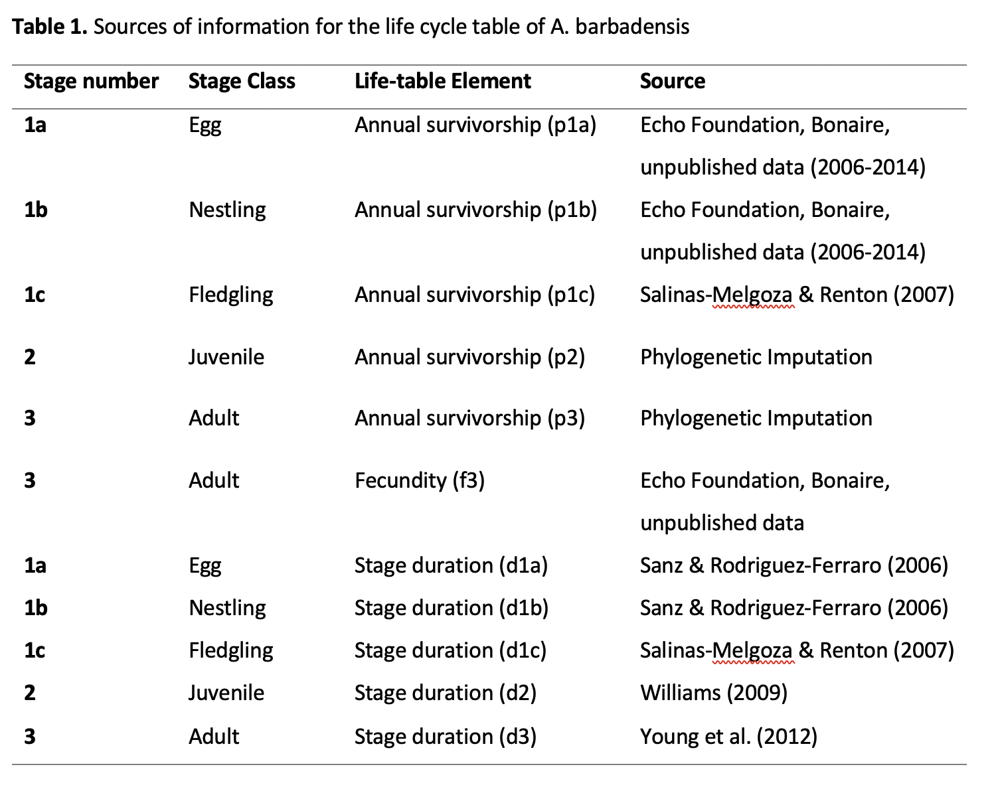
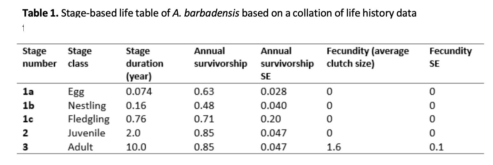

```{r setup, include=FALSE}
knitr::opts_chunk$set(echo = TRUE)

library(popbio)
library(tidyverse) 

source(file = "ysa functions.R")
source(file = "ysa demography.R")
```

## Yellow Shouldered Amazon Parrot - Stage Structure Analysis

This is a report on the stage structure of the Yellow Shouldered Amazon Parrot (YSA).

The estimates of the stage structure are drawn from a model of the life cycle of the YSA.  That post-breeding census model (Kendall et al 2019 for overview of models) is shown here


```{r Life_Cycle, echo=FALSE, fig.cap="Life cycle diagram for the YSA", out.width = '75%'}

```

## The data sources are as follows

```{r data_sources, echo=FALSE, fig.cap="Data sources for parameterising the model", out.width = '75%'}

```

### NOTES ON DATA---Juvenile and Adult Survival values (p2 &p3)

We obtained estimates of the mean and SD for p2 and p3 to use in the LSA via a three-step process. First, we used phylogenetic imputation (described in Methods) to estimate a mean and standard deviation of S3, given estimates of the other rates from data including the YSA, several parrots and 60 other birds.  These data, and the phylogenetic relationship between the species, produced these estimates (described in methods). Second, this estimate of the mean and SD is produced on a transformed (logit) scale.  We needed an estimate of the mean and SD on the response/actual scale. To get this, 100,000 data points were simulated on the transformed scale and then back-transformed these simulated data to the response/actual scale.  Third, we used the mean and SD of these 100,000 simulated and back-transformed data as inputs into the LSA framework.

### NOTES ON DATA---Fledgling survival (p1c)

The fledgling survival value used in my model is the fledgling survival for the lilac crowned amazon, Amazona finschi (Salinas-Melgoza & Renton 2007). Life-table data accompanying the fledgling stage are a recurrent challenge for parameterising avian matrix population models because of data collection difficulties associated with mobile fledglings (Kesler et al. 2012). This estimate was used because the study by Salinas-Melgoza & Renton 2007 because this study had a large sample size across many years.

### NOTES ON DATA---Adult Survival

The life table data available for A. barbadensis was lacking the key estimate of adult survival. In the absence of life table data for certain parts of the life cycle, a common strategy in PVA is to substitute estimates based on related species (Kesler et al. 2012). Instead, I used an estimate of adult survival for A. barbadensis derived using phylogenetic imputation (James, Childs and Beckerman, in prep). Phylogenetic imputation is a method of obtaining estimates for missing traits conditioned on known trait values and phylogenetic relationships across many species. Due to shared evolutionary history, closely related species are predicted to have similar trait values. Furthermore, covariance between traits across species, such as trade-offs between rates of survival and reproduction, produce distinctive signatures which help to guide the imputation process.

Life table data for A. barbadensis from a long-term study on Bonaire was combined with data for 72 additional species of bird extracted from life tables and matrix models (Salguero-Gómez et al. 2016, Sæther & Bakke 2000, Valle 2015, O.R. Jones unpublished data). Vital rates were standardised using the “Mage” R package (Jones & Salguero-Gómez 2016) to allow comparison across species and these data were combined with additional morphometric, life history and ecological data (Myhrvold et al. 2015, Wilman et al. 2014). A sample of phylogenetic trees for the relevant species was obtained from BirdTree.org (Jetz et al. 2012) and combined using the least squares consensus method (Revell 2012). The standardised rates of pre-reproductive and reproductive survival for A. barbadensis, which were derived from non-species-specific estimates from the literature (Rodríguez et al. 2004, Salinas-Melgoza & Renton 2007), were removed from the data, acknowledging that the uncertainty in these estimates may influence the imputation of adult survival rate. Finally, Rphylopars (Goolsby et al. 2017) was used to impute a mean value and confidence interval for adult survival for A. barbadensis (Table 1).

```{r Life_Table, echo=FALSE, fig.cap="Life Table for parameterising the model", out.width = '75%'}

```


## The modelling

To undertake the LSA, vital rates were randomly drawn. Fecundity was sampled from a lognormal distribution and both survival rates were sampled from a beta-distribution. These distributions are drawn from field data (see data_sources). Due to a lack of data, a pre-specified variance–covariance structure among vital rates could not be used to select vital rates and therefore there is no covariation in this analysis. From each set of vital rates, a matrix population model was then constructed, this is repeated 1000 times, constructing 1000 matrix replicates. 

### Stable Stage Distributions


```{r message = FALSE, warning = FALSE, echo = FALSE}

set.seed(123)

# make 1000 matrices
# drawn from ysa beta and normal distributed vital rates
mat1 <- map(1:1000, function(x) ysaFunc(yellow))

## stable stage
stages <- map_dfr(mat1, function(x) popbio::stable.stage(x)) %>% 
  dplyr::rename(Fledgling = col1, Juvenile = col2, Adult = col3) %>% 
  pivot_longer(everything(), names_to = "Stage", values_to = "Proportion") %>% 
  mutate(Stage = factor(Stage, levels = c("Fledgling", "Juvenile", "Adult")))

medians <- stages %>% 
  dplyr::group_by(Stage) %>% 
  dplyr::summarise(medProp = median(Proportion))

ggplot(stages, aes(x = Proportion, fill = Stage))+
  geom_histogram()+
  xlab("Proportion in Stage")+ylab("Number of Observations of Proportion from 1000 sims")+
  geom_vline(data = medians, aes(xintercept = medProp), col = "red")+
  annotate(geom = "text", 
           x = medians$medProp+0.05, y = 400, 
           label = paste0(round(medians$medProp,2)))

```

